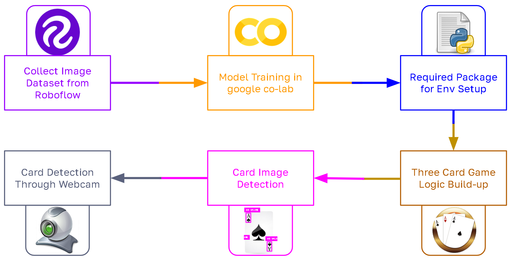
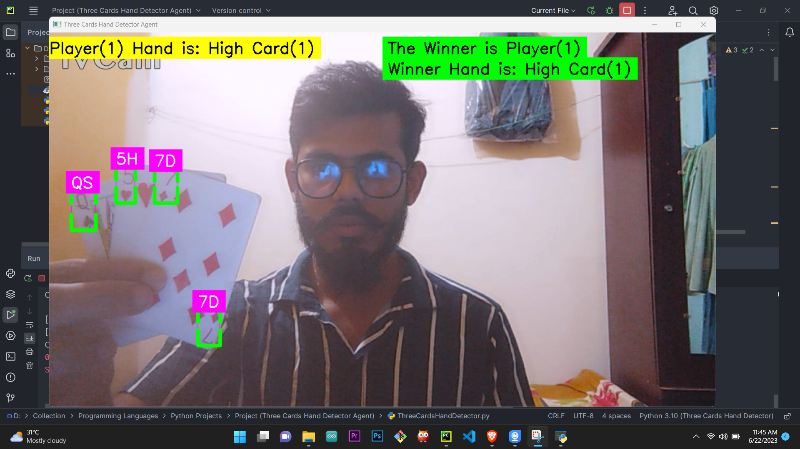
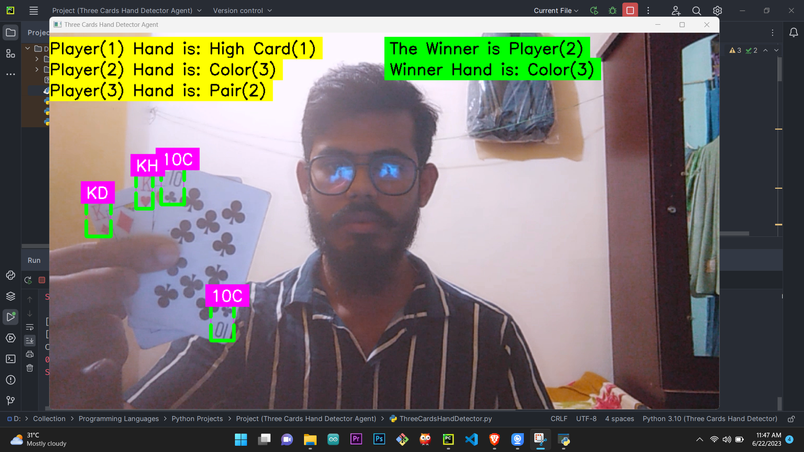
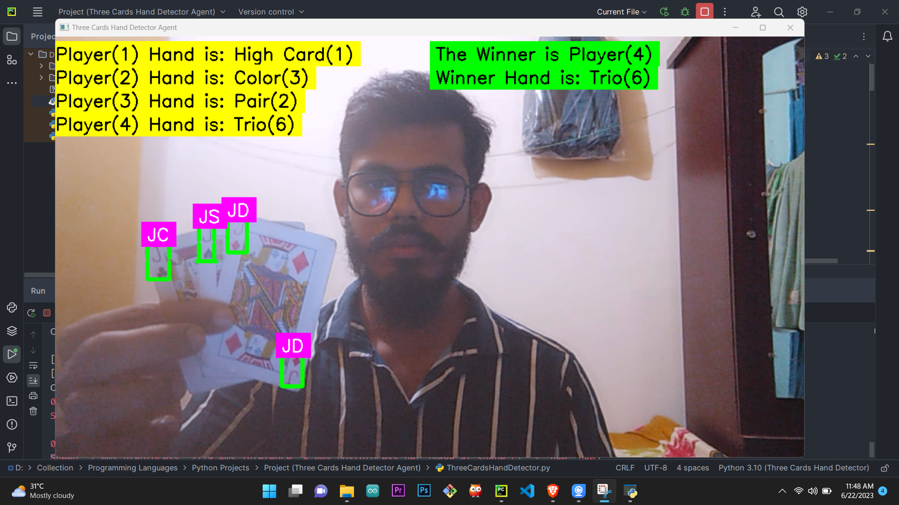
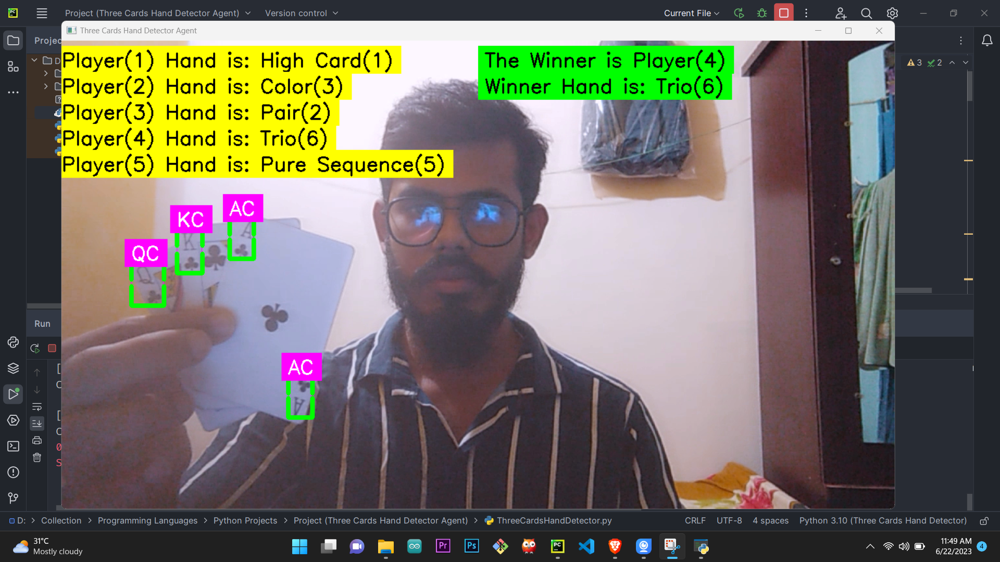

# Three Card Hand Detector Agent

A Three Card Hand Detector Agent is an AI system designed to detect hands consisting of playing cards in card games like poker, Teen Patti, etc. It can automatically identify and detect the player's card hand by analyzing the image or video representation of the cards.

## Real-life Examples
- Casino Automation
- Online Gaming Platforms
- Card Analysis Tools

## Implementation

*Implimentation Steps*

## Results

*Player-1*

*Player-2*

*Player-3*

*Player-4*

*Player-5*
